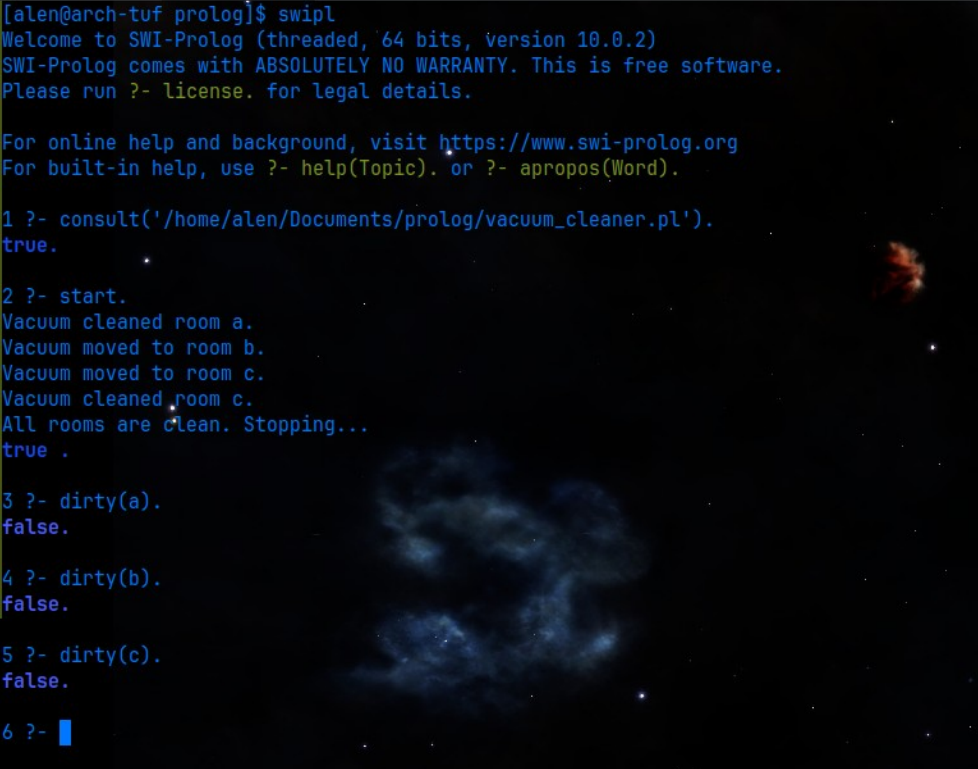

# Vacuum Cleaner Intelligent Agent – Prolog

This project implements a **Vacuum Cleaner Intelligent Agent** using **Prolog**. The agent uses facts and rules to represent its environment, identify dirty rooms, move between adjacent rooms, clean dirty rooms, and stop when all rooms are clean.

## Objectives

- To understand the **PEAS framework** of an intelligent agent.
- To represent an agent's environment using **Prolog facts and rules**.
- To implement decision-making and actions of a vacuum cleaner agent using logical inference.

## PEAS Description

| PEAS Component | Description |
|---|---|
| **Performance Measure** | Clean all rooms efficiently with minimum unnecessary movement |
| **Environment** | Rooms A, B, and C |
| **Actuators** | Move between rooms and clean rooms |
| **Sensors** | Detect the current location and whether a room is dirty |

## Requirements
 - SWI-Prolog

## Running the Program
Load the Prolog file in SWI-Prolog:

```text
?- consult('vacuum.pl').
```
Then execute:

```text
?- start.
```
The vacuum cleaner agent will automatically perform the required actions and stop after all rooms have been cleaned.

## Purpose
This project was developed as an Artificial Intelligence practical to demonstrate the behavior of an intelligent agent and the PEAS task-environment model using Prolog.

## Output
The execution of vacuum_cleaner.pl in SWI-Prolog:

